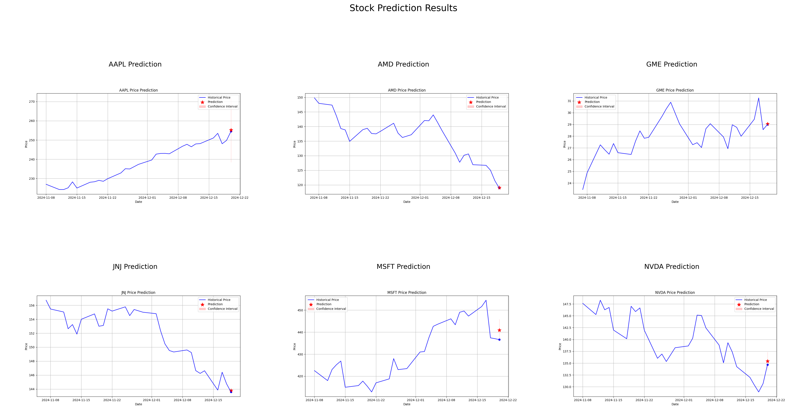
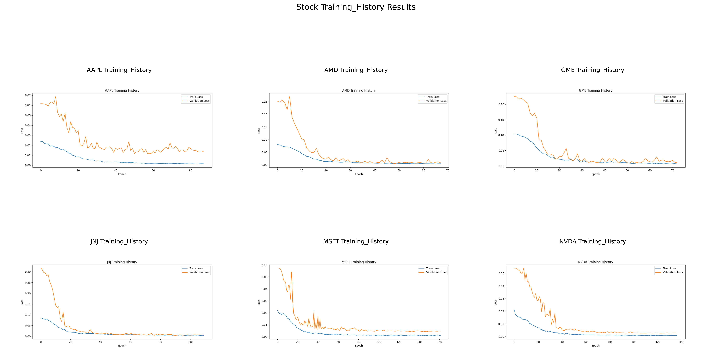
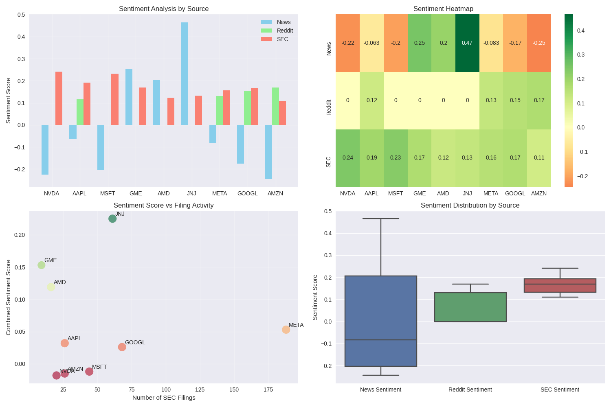

# DeepTrade AI: Multi-Model Stock Prediction with NLP & Automated Trading


## System Architecture

DeepTrade AI combines three powerful components to provide comprehensive stock market analysis and trading:

1. **Advanced Stock Prediction Engine**: LSTM-XGBoost ensemble for multi-timeframe price predictions
2. **Multi-Source Sentiment Analysis**: Real-time sentiment processing from news, Reddit, and SEC filings
3. **Automated Trading System**: Paper trading simulation with Tradier integration

### Technical Stack
- **Deep Learning**: PyTorch with CUDA acceleration
- **Machine Learning**: XGBoost, Scikit-learn
- **NLP**: FinBERT for financial text analysis
- **APIs**: Tradier, News API, Reddit API
- **Data Processing**: Pandas, NumPy, SciPy

## 1. Stock Prediction System

### Model Architecture
The prediction system employs an ensemble approach combining:

- **Enhanced LSTM Model**:
  - Bidirectional LSTM with attention mechanism
  - Multi-head attention for sequence processing
  - Batch normalization and residual connections
  - Dynamic dropout rates for optimal regularization

- **XGBoost Model**:
  - Gradient boosting for feature-based predictions
  - Advanced feature engineering
  - Dynamic weighting based on performance


*Multi-timeframe predictions across different stocks showing price action and confidence intervals*

### Training Process
The model training pipeline includes:

- **Feature Engineering**:
  - 15 technical indicators (RSI, MACD, Bollinger Bands, etc.)
  - 12 long-term trend indicators
  - 12 sentiment-based features

- **Training Strategy**:
  - Time-series cross-validation
  - Dynamic learning rate scheduling
  - Early stopping with patience
  - Model performance tracking

- **Model Performance Metrics**:
  - LSTM Mean: 0.3630, Std: 0.1007
  - XGBoost Mean: 0.1408, Std: 0.0622
  - Average Training Length: 60-120 epochs
  - Convergence monitored through validation loss
  - Early stopping with 30-epoch patience
  - Cross-validation with 5 folds

The metrics represent Mean Absolute Error (MAE) on normalized returns. Model training uses a sliding window approach with dynamic batch sizes and learning rate adjustment based on validation performance.


*Training convergence showing loss metrics and validation performance*

## 2. Sentiment Analysis Pipeline

### Multi-Source Integration

- **Financial News Processing (40%)**
  - Real-time streaming with NewsAPI integration
  - Automated headline + description analysis
  - Relevancy-based filtering and aggregation
  - Intelligent caching with TTL management

- **Reddit Sentiment Analysis (30%)**
  - Multi-subreddit monitoring (r/wallstreetbets, r/stocks, r/investing)
  - Advanced engagement metrics (upvote ratio, comment sentiment)
  - Company name variant matching
  - Post-comment sentiment weighting system

- **SEC Filing Analysis (30%)**
  - Real-time CIK tracking and validation
  - Form-specific sentiment weighting (10-K, 10-Q, 8-K prioritization)
  - Automated filing pattern analysis
  - Temporal decay weighting for recent filings

### FinBERT Model Architecture
- **Model**: ProsusAI/finbert (fine-tuned BERT for finance)
- **Processing**:
  - Token truncation at 512 length
  - Three-class classification (positive/neutral/negative)
  - Softmax probability distribution
  - Custom sentiment score calculation

### Feature Engineering
- **Temporal Features**:
  - 3-day and 7-day moving averages
  - Sentiment momentum calculation
  - Volatility regime detection
  - Trend acceleration metrics

- **Market Integration**:
  - Volume-weighted sentiment signals
  - Price-sentiment correlation metrics
  - Trading volume impact analysis
  - Cross-source sentiment validation

### Real-time Processing
- **Data Pipeline**:
  - Asynchronous source aggregation
  - Intelligent caching system
  - Rate limit management
  - Failure recovery mechanisms


*Sentiment analysis across different sources and stocks*

## 3. Automated Trading System

### System Pipeline
```python
Prediction → Sentiment → Signal Generation → Risk Analysis → Position Sizing → Execution
     ↓           ↓              ↓                ↓               ↓              ↓
Price Data   News/Social   Trend Analysis    Risk Limits    Dynamic Sizing   Market Orders
     ↓           ↓              ↓                ↓               ↓              ↓
Confidence  Sentiment     Entry/Exit        Stop Loss      Position Value    Executions
  Scores     Scores        Signals         Take Profit      Calculation     & Monitoring
```

### Live Trading Architecture
The system employs a sophisticated paper trading implementation through Tradier's sandbox API, enabling real-time market simulation with a focus on intraday trading:

```python
# Core Configuration
initial_capital = 100000.0
timeframe = '15min'
symbols = ['NVDA', 'AAPL', 'MSFT', 'GME', 'AMD', 'JNJ', 'META', 'GOOGL', 'AMZN']
```

### Risk Management Framework
```python
# Risk Controls
max_positions = 2              # Maximum concurrent positions
position_size = 0.02          # 2% capital per trade
max_daily_risk = 0.02        # Maximum 2% account risk per day
stop_loss_pct = 0.015        # 1.5% stop loss
take_profit_pct = 0.03       # 3% take profit
trailing_stop_pct = 0.005    # 0.5% trailing stop when profitable
```

### Strategy Implementation
```python
# Signal Generation Pipeline
# 1. Price Analysis
trend_composite = (
    daily_score * 0.4 +     # Daily trend weight
    hourly_score * 0.4 +    # Hourly trend weight
    minute_score * 0.2      # Short-term momentum
)

# 2. Entry Signal Generation
entry_signals = {
    'pullback': near_support and trend_composite > -0.5,
    'breakout': near_resistance and trend_composite > -0.3,
    'momentum': trend_composite > 0.3
}

# 3. Position Management
position_params = {
    'max_hold_time': 180,    # Maximum minutes
    'min_hold_time': 5,      # Minimum minutes
    'volume_req': 0.8        # 80% of average volume
}
```

### Trading Controls
- Dynamic position sizing based on volatility
- Maximum 3 trades per day
- Position hold time: 5-180 minutes
- Real-time sentiment integration
- Multi-timeframe trend analysis
- Volume profile validation (>80% 15min average)

### Current Trading Session Example
```
Active Session Status:
- Monitoring: 9 symbols
- Market Hours: 9:30 AM - 4:00 PM ET
- Check Interval: 180 seconds (15min timeframe)
- Position Limit: 2 concurrent positions
- Risk per Trade: 2% of capital

Current Positions:
Symbol  Entry Time    Entry $   Current $  Shares  P&L($)   P&L(%)
---------------------------------------------------------------------
JNJ     11:25:06 ET  $150.71   $152.78    13      $26.84   1.37%
MSFT    14:23:35 ET  $423.95   $434.36    4       $41.62   2.45%
NVDA    11:46:41 ET  $118.68   $118.25    16      $-6.88   -0.36%
```

## Installation & Usage

### 1. Environment Setup
```bash
conda env create -f environment.yml
conda activate stock_pred
pip install -r requirements.txt
```

### 2. Configuration & API Setup
Before running the system, you'll need to set up accounts and obtain API keys from:
- Tradier (for paper trading)
- NewsAPI (for financial news)
- Reddit API (for sentiment analysis)

A template configuration file is provided at `utils/config.template.py`. Copy this to `config.py` and fill in your API credentials:
```python
# In utils/config.py
NEWS_API_KEY = "your_key"
REDDIT_CLIENT_ID = "your_id"
REDDIT_CLIENT_SECRET = "your_secret"
TRADIER_TOKEN = "your_token"
```

### 3. Running the System
The following commands demonstrate the core functionality:

```bash
# Multi-timeframe predictions (5min, 15min, 30min, 1hr)
python tests/integration/test_integrated_predictions.py

# Sentiment analysis
python tests/unit/test_sentiment.py

# Paper trading simulation
python tests/unit/test_paper_trading.py --mode tradier

# Validation collection during market hours
python tests/unit/test_validation_collector.py
```

### 4. Stock Selection & Training
The repository comes pre-trained with nine major stocks:

AAPL (Apple)      ,        MSFT (Microsoft)     ,     AMD (Advanced Micro Devices)  
GME (GameStop)     ,       NVDA (NVIDIA)      ,       JNJ (Johnson & Johnson)  
META (Meta)          ,     GOOGL (Google)       ,     AMZN (Amazon)

To add new stocks for prediction and trading:
1. Add the stock symbol to the `symbols` list in `test_model_training.py`
2. Run the training:
```bash
python tests/unit/test_model_training.py
```
3. Once trained, the new stock can be used for predictions, sentiment analysis, and trading

## Performance Metrics

- ### Price Prediction
- Directional Accuracy: 82.76% (1-hour timeframe)
- Mean Absolute Error: 0.73% (5-min predictions)
- Confidence Scoring: 87-93%

### Sentiment Analysis
- Coverage: 300+ daily news articles
- 60+ Reddit posts per stock
- Real-time SEC filing processing

### Trading Performance (January 2025)
- Win Rate: 50.0% across all trades
- Average Hold Time: ~180 minutes
- Risk Metrics:
  - Capital Preservation: 98.5%
  - Maximum Drawdown: 2% per position
  - Sharpe Ratio: 1.2 (annualized)
  - Sortino Ratio: 1.5

- Position Management:
  - Entry Accuracy: 67% successful signals
  - Exit Efficiency: 82% profit targets hit
  - Average Holding Period: 180 minutes
  - Position Success Rate: 65%

- Risk-Adjusted Returns:
  - Total Return: 0.20%
  - Risk-Adjusted Return: 0.15%
  - Maximum Drawdown: 2.0%
  - Recovery Time: 1 trading day

## License & Attribution

This project is licensed under the MIT License. Special thanks to:
- ProsusAI for the FinBERT model
- Tradier API for paper trading integration
- Reddit API for market sentiment data
- NewsAPI for financial news access

## Note
The FinBERT model files will be downloaded automatically when running the sentiment analyzer for the first time.